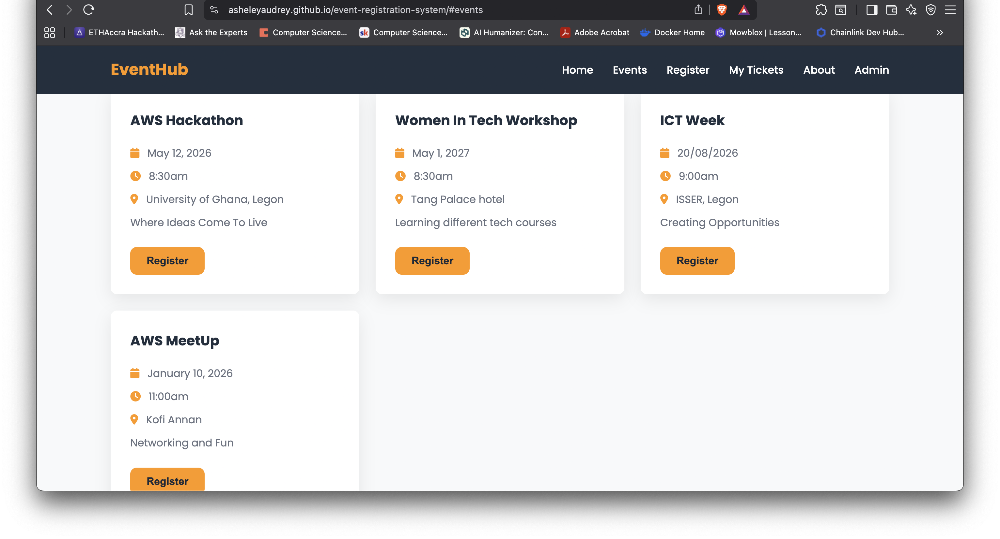
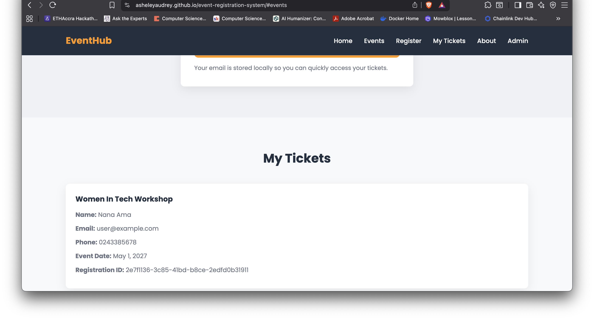
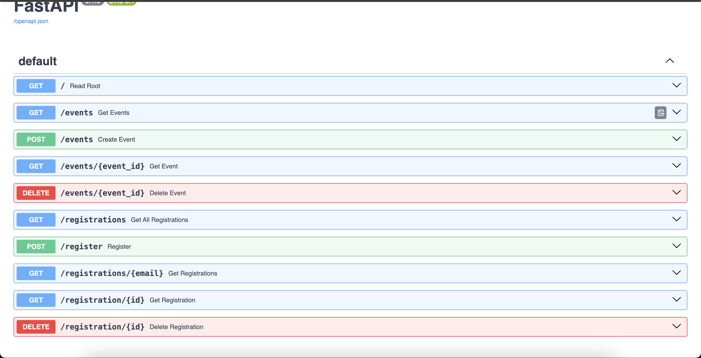
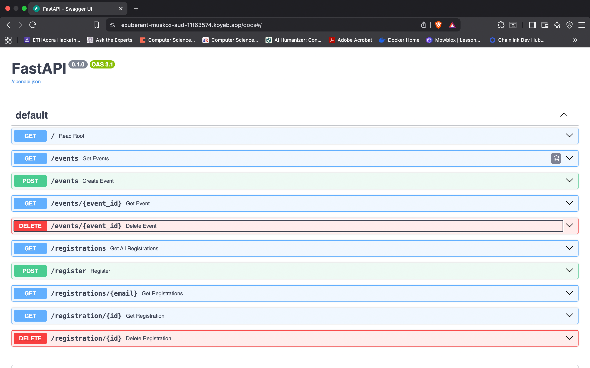
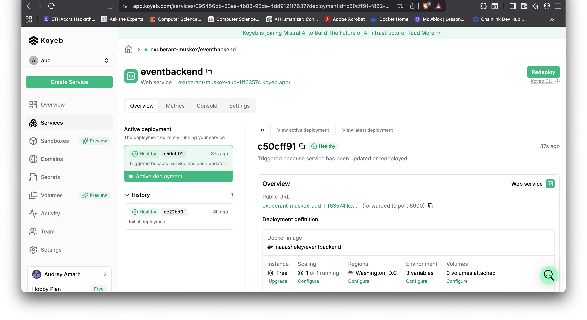
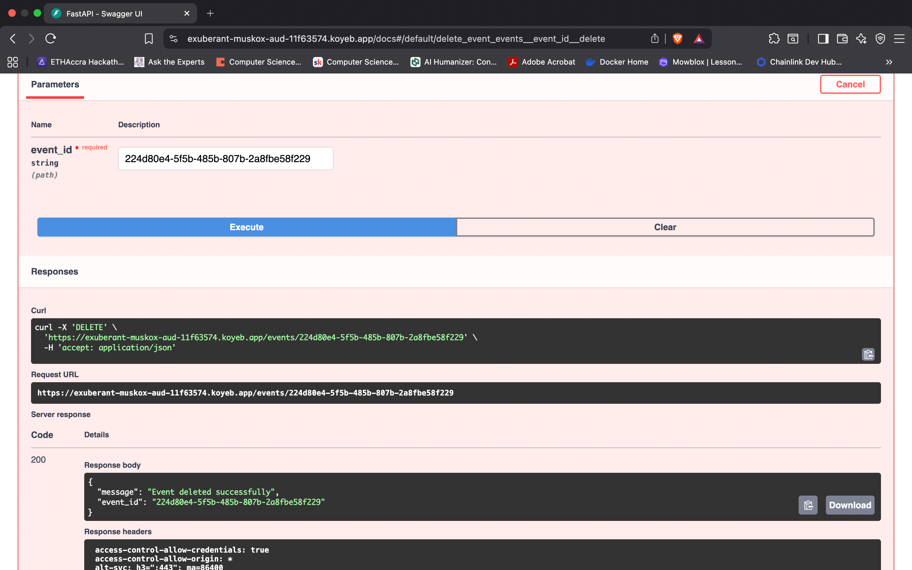
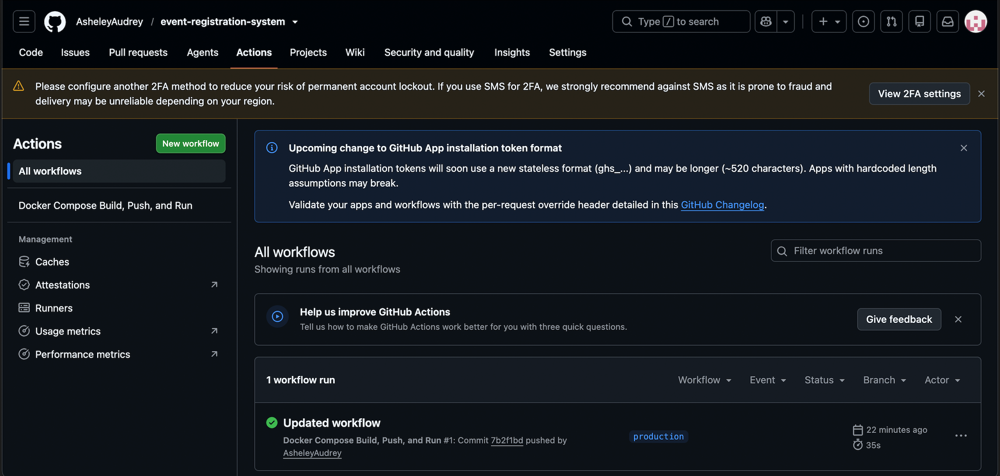

# 🔗 event-registration-system
🎟️ EventHub --- Event Registration & Ticketing System

<strong>A cloud-based event registration and ticketing platform built with FastAPI, AWS DynamoDB, Docker and GitHub Actions.</strong>

  🌐 <a href="https://asheleyaudrey.github.io/event-registration-system/">Live Application</a>
  &nbsp;•&nbsp;
  📖 <a href="https://exuberant-muskox-aud-11f63574.koyeb.app/docs">API Documentation</a>
  &nbsp;•&nbsp;
  💻 <a href="https://github.com/AsheleyAudrey/event-registration-system">GitHub Repository</a>

#### 📌 About the Project

EventHub is an event registration and ticketing system developed as a cloud-computing capstone project.

The application allows users to:

📅 View available events

🎟️ Register for events

🔎 View their registrations using their email address

❌ Cancel registrations

The project demonstrates how a frontend application can communicate witha REST API, how a Python backend can interact with AWS DynamoDB using boto3, and how Docker and GitHub Actions can support application development and deployment.

#### 🎯 Problem Statement

Traditional event registration can rely on manual forms and spreadsheets. This can make it difficult to:

Keep registration information organized

Retrieve a user's registrations quickly

Manage cancellations

Connect the user interface to a central database

Deploy and update the application consistently

#### 💡 Our Solution

EventHub provides a web-based system where the frontend communicates with a FastAPI backend, while registration and event information is stored in Amazon DynamoDB.

#### 🏗️ Architecture

🔄 Request Flow

                         👤 USER
                            │
                            ▼
                  ┌──────────────────┐
                  │  🌐 GitHub Pages │
                  │  HTML / CSS / JS │
                  └────────┬─────────┘
                           │
                     HTTPS API Request
                           │
                           ▼
                  ┌──────────────────┐
                  │    ☁️ Koyeb      │
                  │   FastAPI API    │
                  │  🐳 Container    │
                  └────────┬─────────┘
                           │
                         boto3
                           │
                           ▼
                  ┌──────────────────┐
                  │  🗄️ DynamoDB     │
                  │                  │
                  │  📅 Events       │
                  │  🎟️ Registrations│
                  └──────────────────┘

              🔧 DEVELOPMENT & CI/CD

                  ┌──────────────────┐
                  │  💻 GitHub       │
                  │  Source Control  │
                  └────────┬─────────┘
                           │
                           ▼
                  ┌──────────────────┐
                  │ ⚙️ GitHub Actions│
                  │                  │
                  │ 🐳 Docker build  │
                  │ 🧩 Docker Compose│
                  │ 🚀 CI/CD workflow│
                  └──────────────────┘

#### 🧠 How the Architecture Works

👤 The user opens the EventHub frontend.

🌐 The frontend is served through GitHub Pages.

🔗 JavaScript sends API requests to the FastAPI backend.

☁️ FastAPI runs on Koyeb.

🐳 Docker is used to containerize the application.

🔐 The backend uses AWS permissions configured through IAM.

🔧 boto3 allows FastAPI to communicate with DynamoDB.

🗄️ DynamoDB stores event and registration information.

⚙️ GitHub Actions automates the configured CI/CD workflow.

#### ✨ Features

Feature                   Description

📅 Event Listing          View available events➕ Event Creation         Create an event through the API🔎 Event Lookup           Retrieve a specific event🎟️ Registration           Register for an event👤 Registration Lookup    Find registrations using an email address🔎 Registration Details   Retrieve an individual registration❌ Cancellation           Delete/cancel a registration📱 Responsive UI          Frontend designed for different screen sizes📖 API Documentation      FastAPI Swagger documentation🐳 Containerization       Docker-based application environment⚙️ CI/CD                  GitHub Actions workflow☁️ Cloud Database         Amazon DynamoDB

#### 🛠️ Technology Stack

🎨 Frontend

HTML

CSS

JavaScript

GitHub Pages

⚙️ Backend

Python

FastAPI

Koyeb

🗄️ Database & AWS

Amazon DynamoDB

AWS IAM

boto3

🐳 DevOps

Docker

Docker Compose

GitHub

GitHub Actions

#### 🔌 API Endpoints

Method   Endpoint                   Purpose

`GET`    `/`                        Basic root response
`GET`    `/events`                  List all events
`POST`   `/events`                  Create an event
`GET`    `/events/{event_id}`       Get one event
`DELETE`  `/events/{event_id}`       Delete an event
`GET`    `/registrations`           List registrations
`POST`   `/register`                Register for an event
`GET`    `/registrations/{email}`   View registrations for an email
`GET`    `/registration/{id}`       Get one registration
`DELETE`  `/registration/{id}`       Cancel a registration

#### 📖 Interactive API Documentation

FastAPI provides interactive API documentation through:

[/docs](https://exuberant-muskox-aud-11f63574.koyeb.app/docs)

This makes it possible to test the API endpoints directly from thebrowser.

🗄️ Database

The project uses Amazon DynamoDB to store application data.

📅 Events

The Events data stores information about available events.

🎟️ Registrations

The Registrations data stores information submitted by users when theyregister.

The FastAPI backend communicates with DynamoDB through boto3.

Example:

import boto3

dynamodb = boto3.resource(
    "dynamodb",
    region_name="us-east-1"
)

#### 🔐 AWS IAM

AWS IAM was used to manage access to AWS resources required by the application.

The backend requires appropriate permissions to interact with DynamoDB.

#### 🔒 Security Rule

AWS credentials was never be committed to GitHub.

Did not put credentials directly inside:

main.py

or any other source file.

Used protected environment variables or secrets instead.

🐳 Docker

Docker was used to containerize the application.

Why Docker?

Docker helps package the application together with its required dependencies and runtime environment.

This makes the application environment more consistent between development and deployment.

#### Docker workflow

Application Code
      │
      ▼
 Dockerfile
      │
      ▼
🐳 Docker Image
      │
      ▼
Docker Container
      │
      ▼
FastAPI Application

Docker Compose was also used as part of the project workflow.

⚙️ GitHub Actions & CI/CD

GitHub Actions was used to automate the project's workflow.

The repository contains a GitHub Actions workflow involving the Docker-based application workflow.

A successful workflow run was tested through the GitHub Actions interface.

🔄 CI/CD Concept

👩‍💻 Developer
     │
     │ git push
     ▼
💻 GitHub Repository
     │
     ▼
⚙️ GitHub Actions
     │
     ├── 🐳 Docker workflow
     └── ✅ Automated process

This reduces the need to manually repeat the same build/deployment steps after every change.

#### ☁️ Deployment

🌐 Frontend

The frontend is deployed using GitHub Pages.

🔗 Live Application:

https://asheleyaudrey.github.io/event-registration-system/

⚙️ Backend

The FastAPI backend is deployed on Koyeb.

The deployed API provides interactive documentation through:

https://exuberant-muskox-aud-11f63574.koyeb.app/docs

🧪 Testing

The system was tested from the frontend through to the database.

✅ Tests Performed

🌐 Frontend loads successfully

📅 Events are retrieved from the backend

📋 Events are displayed on the frontend

🎟️ User registration works

🗄️ Registration information is stored in DynamoDB

🔎 Registrations can be retrieved using an email address

⚙️ FastAPI endpoints are accessible through the deployed API

🐳 Docker workflow was tested

🚀 GitHub Actions workflow completed successfully

🔄 End-to-End Flow

Frontend
   ↓
FastAPI
   ↓
boto3
   ↓
DynamoDB
   ↓
Response
   ↓
Frontend

#### 📸 Project Evidence

The following screenshots can be used to demonstrate that the project is working:

🌐 Frontend

⚙️ FastAPI

🎟️ Registration

⚙️ GitHub Actions

#### 📂 Project Structure

event-registration-system/
│
├── 📁 .github/
│   └── 📁 workflows/
│       └── ⚙️ GitHub Actions workflow
│
├── 📁 frontend/
│   ├── 🎨 HTML
│   ├── 🎨 CSS
│   └── ⚡ JavaScript
│
├── 📁 backend/
│   ├── 🐍 FastAPI application
│   ├── 🐳 Dockerfile
│   └── 🐳 docker-compose.yaml
│
├── 📄 index.html
├── 📄 requirements.txt
├── 📄 README.md
└── 📄 Docker configuration files

#### 🚀 Running the Project

1️⃣ Clone the Repository

git clone https://github.com/AsheleyAudrey/event-registration-system.git

cd event-registration-system

2️⃣ Install Backend Dependencies

Create a virtual environment and install the required Python packages according to the project's dependency file.

3️⃣ Run with Docker

Build and run the application using the Docker configuration included in the repository.

For example:

docker compose up --build

Use the exact Docker Compose command/configuration currently included in the repository.

4️⃣ Open the Application

Open the frontend locally or use the deployed application:

https://asheleyaudrey.github.io/event-registration-system/

#### 🔗 Project Links

🎟️ Resource                            Link

🌐 Live Frontend                    https://asheleyaudrey.github.io/event-registration-system/

💻 GitHub Repository                https://github.com/AsheleyAudrey/event-registration-system

⚙️ API Documentation                https://exuberant-muskox-aud-11f63574.koyeb.app/docs

#### 👩🏽‍💻 Author

Audrey Asheley Amarh

⭐ If you found this project useful

Feel free to explore the repository and learn from the implementation.

